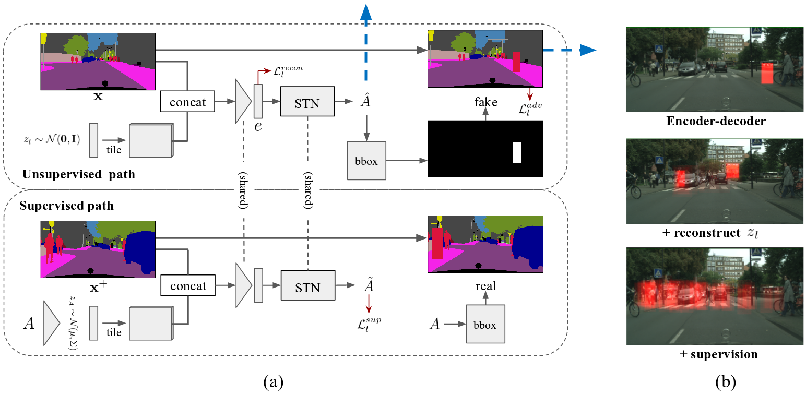
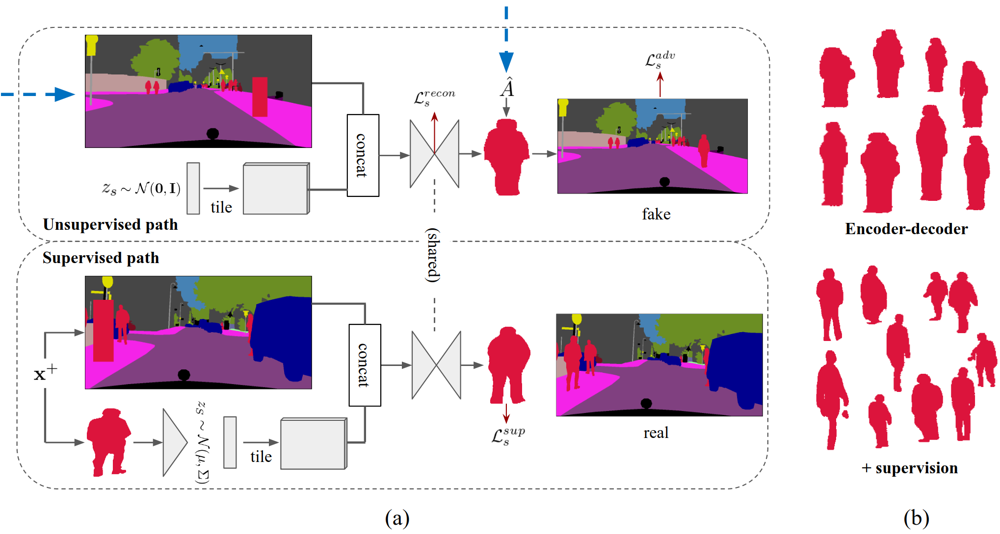

#  Context-aware Synthesis and Placement of Object Instances

Please find the technique details in the [paper](https://papers.nips.cc/paper/8240-context-aware-synthesis-and-placement-of-object-instances.pdf)

## License
Copyright (C) 2018 NVIDIA Corporation. All rights reserved. Licensed under the CC BY-NC-SA 4.0 license (https://creativecommons.org/licenses/by-nc-sa/4.0/legalcode).

## Network Architecture
The network contains two major modules, a "where" module (the first figure) to determine the fesiable location of the object, and a "what" module (the second figure) to generate a proper shape.
The two modules are jointly trained, where the blue dashed arrows indicate the linkage of them.

&nbsp;&nbsp;&nbsp;&nbsp;&nbsp;&nbsp;&nbsp;&nbsp;&nbsp;&nbsp;&nbsp;&nbsp;&nbsp;&nbsp;&nbsp;&nbsp;&nbsp;&nbsp;&nbsp;

## Dataset
- Download and place [cityscape dataset](https://www.cityscapes-dataset.com/) at "db_root" in the options.py

## How to run the code
- Check `options.py` and specify your own path accordingly.
- Run `main.py`, it will save results for pairs of different random vectors, i.e., (z_appr1, z_spatial1), (z_appr2, z_spatial1), and (z_appr1, z_spatial2)

**All code tested on Ubuntu 16.04, pytorch 0.3.1, and opencv 3.4.0**

## Explanation of code details
`options.py`
- `db_root`: as explained above
- `target_class`: person or car
- `image_sizex_small`: image width when training where module
- `image_sizey_small`: image height when training where module
- `image_sizex_big`: image width when training what module
- `image_sizey_big`: image height when training what module
- `compact_sizex`: image width of generated object
- `compact_sizey`: image height of generated object
- `embed_dim_small`: dim of output of an encoder in where module
- `embed_dim_big`: dim of output of an encoder in what module

`main.py`
- Training part starts from line 56
- Between line 56 and 161, it loads training images and check whether it is okay to proceed.
  We pick 2 seg maps at random.
  Image 1) `b_real_seg_small` or `b_real_seg_big` corresponds to x+ in where and what.
     It is contains at least one object (variable "has_ins"), then proceed (line 94).
     Then, check whether there is at least one proper object that are not too small or too narrow (line 120).
  Image 2) `b_cond_seg_small` or `b_cond_seg_big` corresponds to x in where and what. It is just a random image.

- Forward starts at line 161
- Log at line 186
- Save images at line 203

`model.py`
- Define networks in line 44. Networks are actually defined in networks.py
- Define optimizers in line 114
- Set inputs from line 152-240
  We transform a box using A into x+ to prepare real examples, which is done by `stn_fix`.
- Reparameterize function for VAE in line 241
- Computing edges in line 249-266
- Helper functions in line 268-286
- Forward where supervised in line 288-315
- Forward where/what unsupervised in line 316-374
- Forward what supervised in line 375-399
- Backward for each discriminator in line 401-463
- Backward for generation parts in line 465-539
  `coord_loss`: make sure that the whole compact instance is transformed.
  `stn_theta_loss`: preventing to predict too small objects or flipped objects
  For other losses you can understand what it is by its name.

